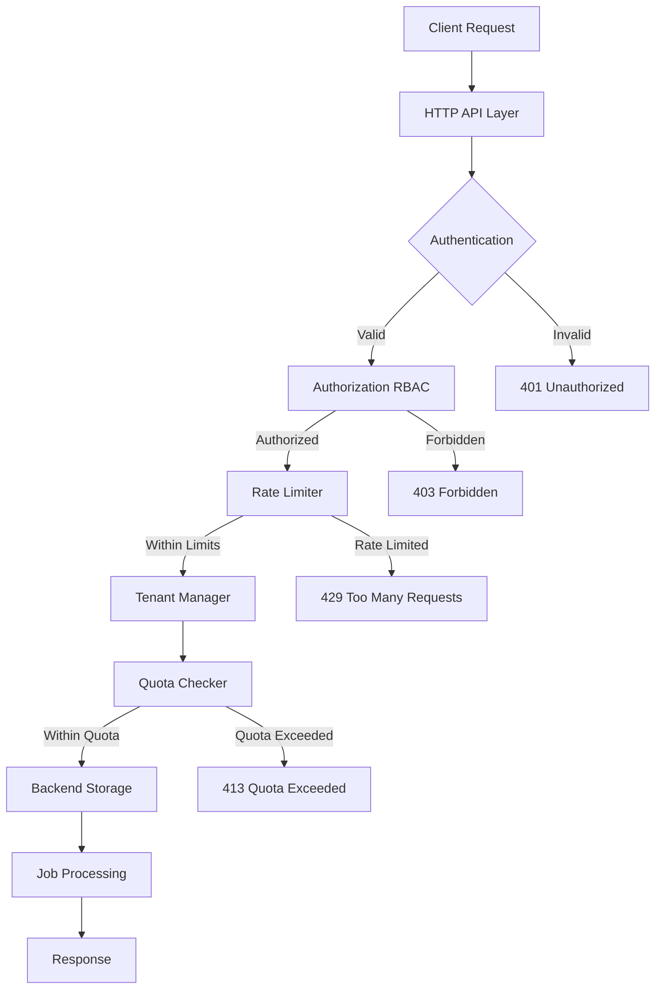

# System Architecture

## Architecture Overview

### Multi-Tenant Architecture
```
┌─────────────────────────────────────────────────────────────┐
│                     Admin API Layer                         │
│  ┌─────────────┐ ┌─────────────┐ ┌─────────────────────────┐│
│  │    RBAC     │ │    Auth     │ │   Tenant Management     ││
│  └─────────────┘ └─────────────┘ └─────────────────────────┘│
└─────────────────────────────────────────────────────────────┘
┌─────────────────────────────────────────────────────────────┐
│                   Rate Limiting Layer                       │
│  ┌─────────────┐ ┌─────────────┐ ┌─────────────────────────┐│
│  │ Per-Tenant  │ │ Per-Queue   │ │    Global Limits       ││
│  │ Rate Limits │ │ Rate Limits │ │                        ││
│  └─────────────┘ └─────────────┘ └─────────────────────────┘│
└─────────────────────────────────────────────────────────────┘
┌─────────────────────────────────────────────────────────────┐
│                     Job Queue Layer                         │
│  ┌─────────────┐ ┌─────────────┐ ┌─────────────────────────┐│
│  │   Tenant A  │ │   Tenant B  │ │       Tenant C         ││
│  │ Queue1,2,3  │ │ Queue1,4,5  │ │      Queue2,6          ││
│  └─────────────┘ └─────────────┘ └─────────────────────────┘│
└─────────────────────────────────────────────────────────────┘
┌─────────────────────────────────────────────────────────────┐
│                   Storage Backend Layer                     │
│  ┌─────────────┐ ┌─────────────┐ ┌─────────────────────────┐│
│  │    Redis    │ │ PostgreSQL  │ │        Memory          ││
│  └─────────────┘ └─────────────┘ └─────────────────────────┘│
└─────────────────────────────────────────────────────────────┘
```

## Core Interfaces

The system is built with pluggable backends that implement extended interfaces for multi-tenancy:

### Backend Interface

```go
// Core Backend Interface
type Backend interface {
    // Standard Operations
    Enqueue(job *Job) error
    EnqueueWithOpts(job *Job, dedupeKey, idempotencyKey string) error
    Dequeue(queueName, workerID string, visibilityTimeout time.Duration) (*Job, error)
    Ack(job *Job) error
    Fail(job *Job, reason string) error
    GetJob(jobID string) (*Job, error)
    UpdateJob(job *Job) error
    RequeueExpired(queueName string) error
    PromoteDelayed(queueName string) error
    ListQueues() ([]string, error)
    GetQueueLength(queueName string) (int64, error)
    
    // Multi-Tenant Operations (NEW)
    EnqueueTenant(job *Job, tenantID string) error
    DequeueTenant(queueName, workerID, tenantID string, visibilityTimeout time.Duration) (*Job, error)
    ListTenantQueues(tenantID string) ([]string, error)
    GetTenantQueueLength(queueName, tenantID string) (int64, error)
}
```

### Tenant Management Interface

```go
// Tenant Management Interface
type TenantManager interface {
    CreateTenant(ctx context.Context, tenant *Tenant) error
    GetTenant(ctx context.Context, tenantID string) (*Tenant, error)
    UpdateTenant(ctx context.Context, tenant *Tenant) error
    DeleteTenant(ctx context.Context, tenantID string) error
    ListTenants(ctx context.Context) ([]*Tenant, error)
    
    // Usage & Quota Management
    GetTenantUsage(ctx context.Context, tenantID string) (*TenantUsage, error)
    UpdateUsage(ctx context.Context, tenantID string, usage *TenantUsage) error
    CheckQuota(ctx context.Context, tenantID string, operation string) error
}
```

### Rate Limiting Interface

```go
// Rate Limiting Interface
type RateLimiter interface {
    Allow(tenantID, operation string) bool
    GetLimit(tenantID string) (*RateLimit, error)
    SetLimit(tenantID string, limit *RateLimit) error
    Reset(tenantID string) error
}
```

## Component Interaction Flow



## Backend Implementations

### Redis Backend Architecture

```
┌─────────────────────────────────────────────────────────────┐
│                    Redis Backend                            │
│                                                             │
│  ┌─────────────────┐  ┌─────────────────┐                 │
│  │   Tenant Keys   │  │  Rate Limiting  │                 │
│  │ tenant:A:jobs:  │  │   Redis Keys    │                 │
│  │ tenant:B:jobs:  │  │ rate:tenant:A   │                 │
│  │ tenant:C:jobs:  │  │ rate:tenant:B   │                 │
│  └─────────────────┘  └─────────────────┘                 │
│                                                             │
│  ┌─────────────────┐  ┌─────────────────┐                 │
│  │  Lua Scripts    │  │ Usage Tracking  │                 │
│  │  Atomic Ops     │  │ usage:tenant:A  │                 │
│  │  Enqueue/Dequeue│  │ usage:tenant:B  │                 │
│  │  Quota Check    │  │ usage:tenant:C  │                 │
│  └─────────────────┘  └─────────────────┘                 │
└─────────────────────────────────────────────────────────────┘
```

**Key Features:**
- Tenant-isolated keyspace with `tenant:<tenantID>:jobs:<queue>:z` pattern
- Atomic operations using Lua scripts for consistency
- Rate limiting with Redis-based token buckets
- Real-time usage tracking and quota enforcement
- High-performance sorted sets for priority queues

### PostgreSQL Backend Architecture

```
┌─────────────────────────────────────────────────────────────┐
│                PostgreSQL Backend                           │
│                                                             │
│  ┌─────────────────┐  ┌─────────────────┐                 │
│  │   Jobs Table    │  │  Tenants Table  │                 │
│  │ - tenant_id     │  │ - id            │                 │
│  │ - queue_name    │  │ - quotas        │                 │
│  │ - status        │  │ - rate_limits   │                 │
│  │ - priority      │  │ - usage         │                 │
│  └─────────────────┘  └─────────────────┘                 │
│                                                             │
│  ┌─────────────────┐  ┌─────────────────┐                 │
│  │   Indexes       │  │  Rate Limits    │                 │
│  │ tenant_id_idx   │  │ rate_limits tbl │                 │
│  │ queue_name_idx  │  │ - tenant_id     │                 │
│  │ status_idx      │  │ - tokens        │                 │
│  │ available_at    │  │ - last_refill   │                 │
│  └─────────────────┘  └─────────────────┘                 │
└─────────────────────────────────────────────────────────────┘
```

**Key Features:**
- Uses `SELECT FOR UPDATE SKIP LOCKED` for atomic job claiming
- Tenant isolation via `tenant_id` column with proper indexing
- Full ACID transaction support with connection pooling
- JSONB storage for flexible metadata
- Row-level security for multi-tenant data isolation

### Memory Backend Architecture

```
┌─────────────────────────────────────────────────────────────┐
│                   Memory Backend                            │
│                                                             │
│  ┌─────────────────┐  ┌─────────────────┐                 │
│  │ Tenant Storage  │  │  Rate Limiters  │                 │
│  │ map[tenantID]   │  │ map[tenantID]   │                 │
│  │   JobQueues     │  │   TokenBucket   │                 │
│  │   Usage Stats   │  │   LastRefill    │                 │
│  └─────────────────┘  └─────────────────┘                 │
│                                                             │
│  ┌─────────────────┐  ┌─────────────────┐                 │
│  │   Mutexes       │  │   Priorities    │                 │
│  │ Thread-Safe     │  │ Priority Queues │                 │
│  │ Operations      │  │ Sorted by Prio  │                 │
│  │ sync.RWMutex    │  │ heap.Interface  │                 │
│  └─────────────────┘  └─────────────────┘                 │
└─────────────────────────────────────────────────────────────┘
```

**Key Features:**
- Tenant-specific in-memory storage maps
- Thread-safe operations using Go mutexes
- Rate limiting with in-memory token buckets
- Perfect for development, testing, and demos

## Scalability Design

### Horizontal Scaling
- **Multiple Server Instances**: Stateless servers with shared backend
- **Load Balancing**: Distribute requests across multiple instances
- **Shared State**: All persistent state stored in backend (Redis/PostgreSQL)
- **Session Affinity**: Not required due to stateless design

### Backend Considerations
- **Redis Scaling**: Redis Cluster support for horizontal scaling
- **PostgreSQL Scaling**: Read replicas and connection pooling
- **Memory Scaling**: Single-instance only, perfect for development

### Performance Optimization
- **Connection Pooling**: Efficient resource utilization
- **Async Processing**: Non-blocking job operations
- **Batch Operations**: Group operations where possible
- **Caching**: In-memory caching of frequently accessed data

## Security Architecture

### Multi-Layer Security
1. **Authentication Layer**: Bearer token validation
2. **Authorization Layer**: RBAC with granular permissions
3. **Tenant Isolation**: Complete data separation per tenant
4. **Rate Limiting**: Prevent abuse and ensure fair usage
5. **Quota Enforcement**: Resource usage limits per tenant

### Data Isolation Strategies
- **Redis**: Keyspace prefixes with tenant ID
- **PostgreSQL**: Row-level security with tenant_id filtering
- **Memory**: Separate data structures per tenant

This architecture ensures complete tenant isolation, high performance, and enterprise-grade security while maintaining simplicity and extensibility.